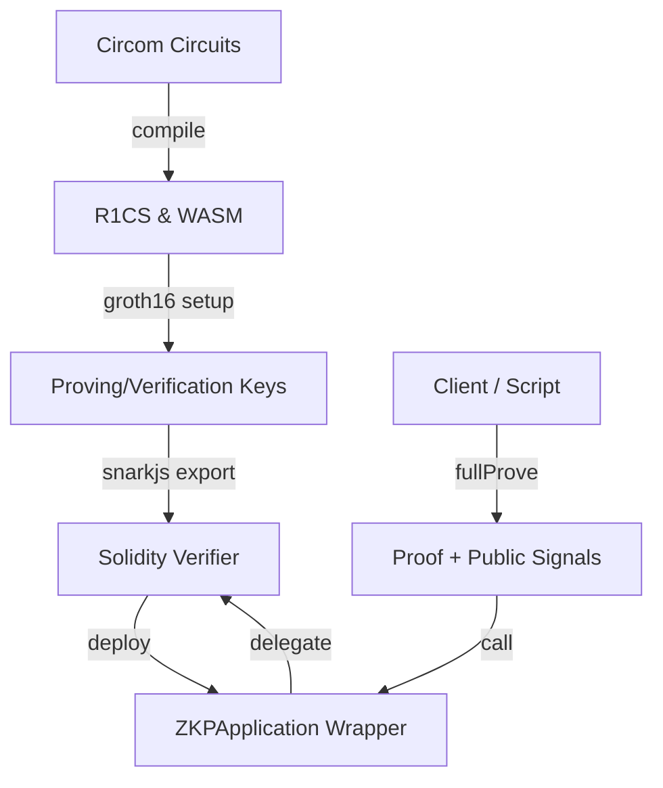

# Blockchain Security ZKP Verifier

Production-ready reference implementation for privacy-preserving proof generation and on-chain Groth16 verification. The project targets Ethereum-compatible networks (Sepolia, Mumbai, or local Hardhat) and ships with Circom circuits, Solidity verifier wrappers, automation scripts, and documentation aligned with ISO/TC 307-aligned privacy principles.

## Why This Project

- Enforce privacy-by-design for identity, balance, and whitelist proofs.
- Provide auditable, reproducible trusted-setup workflows.
- Offer hardened smart-contract wrappers with explicit validation and ownership controls.
- Deliver end-to-end tooling (compile → prove → verify on-chain) with CI checks and documentation.

## Architecture



## Repository Structure

- `circuits/` – Circom circuits for age verification, balance thresholds, and Merkle membership.
- `contracts/` – Verifier stub, wrapper application, and shared interfaces.
- `docs/` – Architecture, setup, security, and API reference.
- `scripts/` – Automation for compilation, proof generation, and deployment.
- `test/` – Mocha/Chai + Hardhat coverage for circuits and contracts.

## Quickstart

1. **Install prerequisites**
   - Node.js 20+, npm 10+
   - Circom v2.1.8+ and `snarkjs` v0.7.0+
   - `git`, `bash`, and (optionally) Docker

2. **Install dependencies**

   ```bash
   npm install
   ```

3. **Environment**
   - Copy `.env.example` to `.env` and populate RPC URLs, private keys, and explorer keys.

4. **Compile circuits & generate keys**

   ```bash
   bash scripts/compile_circuits.sh
   ```

5. **Generate a proof (example)**

   ```bash
   node scripts/generate_proof.js examples/age_input.json artifacts/age_verification/age_verification_js/age_verification.wasm artifacts/age_verification/age_verification.zkey
   ```

6. **Deploy verifier + wrapper**

   ```bash
   npx hardhat run scripts/deploy.js --network sepolia
   ```

7. **Build Solidity artifacts offline** (avoids compiler downloads during tests/CI)
   ```bash
   npm run build:artifacts
   ```

## Usage Notes

- Replace `contracts/Verifier.sol` with the circuit-specific verifier produced by `snarkjs zkey export solidityverifier` for production deployments.
- Pass proof elements as `a`, `b`, `c`, and `publicSignals` arrays (see `docs/API.md` for the ABI schema).
- Include replay protection data (nonce/timestamp) as part of `publicSignals` for application-level security.
- Sample witness inputs live in `examples/` for quick smoke tests and CLI runs.

## Testing & Quality

- Run contract + circuit tests: `npm test`
- Lint JavaScript: `npm run lint`
- Format check: `npm run format:check`
- Build Hardhat artifacts without network access: `npm run build:artifacts`

## Contributing

See [CONTRIBUTING.md](CONTRIBUTING.md) for contribution, issue, and security disclosure guidance.

## License

MIT License. See [LICENSE](LICENSE).
