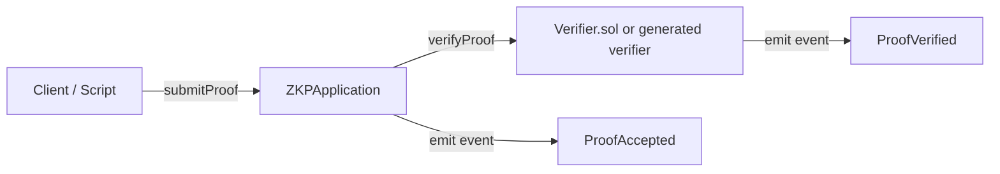

# Architecture Overview

This project provides a reference stack for generating and verifying Zero-Knowledge Proofs (ZKPs) for blockchain applications. It targets Ethereum-compatible networks and is designed for privacy-preserving assertions such as age verification, balance thresholds, and whitelist membership.

## Components

- **Circuits (Circom)**: `circuits/` contains circuits for age verification, balance threshold enforcement, and Merkle membership. Each circuit defines private inputs, public signals, and constraints.
- **Proof Tooling (`snarkjs`)**: Handles trusted setup, proving key generation, proof creation, and verifier export (Groth16/PLONK).
- **Verifier Contracts (Solidity)**: `contracts/Verifier.sol` contains a validated Groth16 stub; replace with the circuit-specific verifier generated from `.zkey` files. `contracts/ZKPApplication.sol` wraps application-specific checks and emits events for monitoring.
- **Automation Scripts**: `scripts/compile_circuits.sh` orchestrates circuit compilation and key generation. `scripts/generate_proof.js` runs end-to-end proving, and `scripts/deploy.js` deploys verifiers via Hardhat.
- **Artifacts Builder (Offline)**: `scripts/build_artifacts.js` produces Hardhat-compatible artifacts with `solc-js`, avoiding remote compiler downloads in CI or air-gapped environments.
- **Tests**: `test/` includes circuit and contract tests with Mocha/Chai and Hardhat's Ethers helpers.

## Data Flow

1. **Compile** – Circom produces `.r1cs`, `.wasm`, and symbol files. `snarkjs` derives proving/verification keys.
2. **Prove** – Application collects private inputs and invokes `snarkjs.groth16.fullProve` (or PLONK equivalent).
3. **Verify Off-chain** – Scripts validate proofs locally to catch issues before on-chain submission.
4. **Verify On-chain** – Contracts receive `a`, `b`, `c`, and `publicSignals` in calldata. `Verifier.verifyProof` performs validation then (in production) delegates to generated pairing checks. `ZKPApplication` emits events for observability.

## Contract Interaction Diagram

## Security Considerations

- Use unique Powers of Tau transcripts per environment and document contributions.
- Store proving keys securely; only verification keys should be public.
- Harden smart contracts with access control for administration and immutability for verification keys when possible.
- Include replay protection by encoding nonce/timestamp data as public signals for application-level proofs.

## Extensibility

- Add new circuits by placing `.circom` files in `circuits/` and extending `scripts/compile_circuits.sh` entries.
- Support PLONK by generating PLONK verifiers with `snarkjs zkey export solidityverifier --plonk` and adding verification handling in `ZKPApplication.sol`.
- Integrate with client applications via REST/GraphQL by wrapping `scripts/generate_proof.js` logic or porting to an Express/Fastify service.
